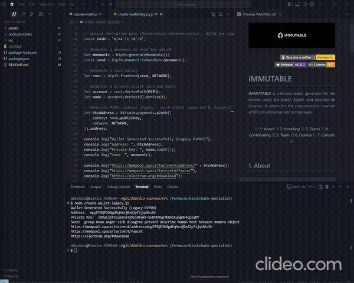

    

    
    
    
        

# iMMUTABLE

 <strong>iMMUTABLE</strong> is a simple Bitcoin wallet generator for the testnet using the bip32, bip39, and bitcoinjs-lib libraries and was developed as part of ongoing learning about blockchain. It allows for the programmatic creation of Bitcoin addresses and private keys. 

  

   ⋮⋮⋮
  <a href="#1-about">1. About</a> ⋮⋮⋮
  <a href="#2-installing">2. Installing</a> ⋮⋮⋮
  <a href="#3-demo">3. Demo</a> ⋮⋮⋮
  <a href="#4-contributing">4. Contributing</a> ⋮⋮⋮
  <a href="#5-team">5. Team</a> ⋮⋮⋮
  <a href="#6-license">6. License</a> ⋮⋮⋮
  <a href="#7-contact">7. Contact</a> ⋮⋮⋮

  

## 1. About

 This project generates Bitcoin wallets for the testnet, allowing for the creation of addresses and private keys. It is important to note that the generated addresses are for testnet and should not be used for real transactions. 

 For a generated address to be found in a block explorer, it must have been used in at least one transaction. Additionally, the created wallets can be imported into the Electrum Bitcoin Wallet. To obtain test funds, you can use a faucet like the Bitcoin Testnet Faucet.

#### Main Technologies

`⭐` `Node.js` _An open-source, cross-platform JavaScript runtime environment._  
`⭐` `bip32` _Library for creating and deriving hierarchical deterministic (HD) keys._  
`⭐` `bip39` _Library for generating and manipulating mnemonics that serve as seeds._  
`⭐` `bitcoinjs-lib` _Library for Bitcoin-related operations, such as address generation._  

## 2. Installing

 To install, clone the repository and install dependencies using the command 'npm install'. 

## 3. Demo

 Run 'node create-wallet-legacy.js' to generate a new wallet and display the information in the console. At <a href="https://mempool.space/testnet4/address/mpyETSQP2b9gdEqHznjBxA2yfijqsBbzDr">mempool.space</a>, we'll see balance and transaction information for the generated address. At <a href="https://mempool.space/testnet4/faucet">mempool testnet faucet</a>, we can transfer funds and wait for the block to be mined. Back at <a href="https://mempool.space/testnet4/address/mpyETSQP2b9gdEqHznjBxA2yfijqsBbzDr">mempool.space</a>, we'll monitor transaction confirmations in real time.

    

## 4. Contributing

 Contributions are welcome. Feel free to open issues or pull requests.. 

## 5. Team

 Lorem Ipsum is simply dummy text of the printing and typesetting industry. Lorem Ipsum has been the industry's standard dummy text ever since the 1500s, when an unknown printer took a galley of type and scrambled it to make a type specimen book. 

| DEVELOPER            | DEVELOPER           | DEVELOPER           |  UX/UI     | 
| :------------------: | :------------------:| :------------------:| :------------------:|
 |  |  | 
| [@alexaquino](https://www.linkedin.com/in/aquinoalex/) | [@alexaquino](https://www.linkedin.com/in/aquinoalex/) | [@alexaquino](https://www.linkedin.com/in/aquinoalex/)| [@alexaquino](https://www.linkedin.com/in/aquinoalex/) | 

## 6. License

Copyright (c) Alex Aquino. All rights reserved.  
Licensed under the [MIT](LICENSE.txt) license.

## 7. Contact

    
    
    

 This project was developed as part of ongoing learning about blockchain technology and software development. Feel free to explore and contribute! 

